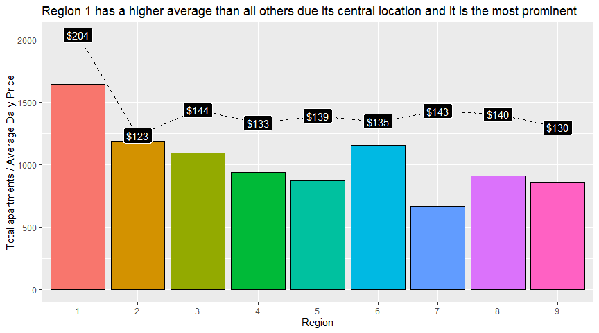
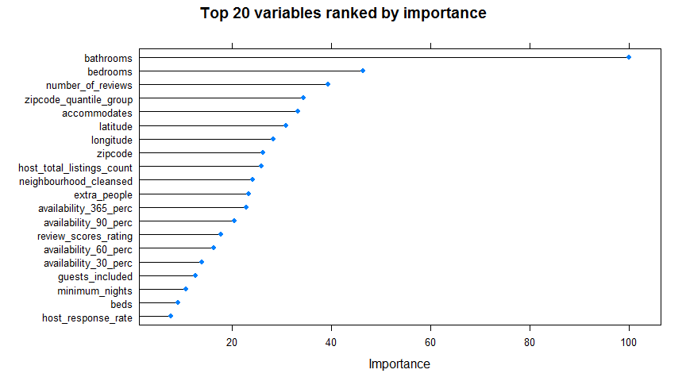

---
    output:
      html_document:
        
        toc: true
        toc_float: false
        toc_depth: 2
        number_sections: true
        
        code_folding: hide 
        
        fig_height: 5
        fig_width: 9
        fig_align: "center"
    
        highlight: pygments
        theme: cerulean
        
        keep_md: true
        
    title: "AirBnb - Milan - Price Prediction Model"
    subtitle: "Exploratory Data Analysis and Price Prediction Model"
    author: "by Peter Hontaru"
---


```{r}
knitr::opts_chunk$set(
    echo = TRUE, # show all code
    tidy = FALSE, # cleaner code printing
    size = "small", # smaller code
    
    fig.path = "figures/",# where the figures will end up
    out.width = "100%",

    message = FALSE,
    warning = FALSE
    )
```

<center>


</center>


# Introduction


## Problem statement

**Can we predict the price at which an apartment should be rented based on a number of variables? If so, which variables influenced the price the most?**


## Who is this project intended for?

* **landlords** looking to calculate the optimal price for their apartment
* **tourists** trying understand if they're getting a good deal
* *those looking to find a model that might fit other datasets, since the AirBnb data is generally standardised across countries/cities*


## Why this dataset?

I've always been fascinated with the italian culture, history, places (and food!), so much so that this year I've started learning Italian. While looking to work on a data science project, I found this dataset on kaggle and thought it would be interesting to dive into it.


<center>


</center>


## Summary:

* the region did not prove to be a significant predictor of the price. Rather, the proximity to the city centre was shown to be more important



* we used three different models in our project: Stepwise Regression, Gradient Boosting Machine and Random Forrest. The Random Forrest model was proven to be the most optimal model in terms of Rsquared (0.46), MAE (\$30) and RMSE (\$42)


* while this model has a similar or higher Rsquared values to that of other AirBnb analyses (ie. Milan, New York), it is not high enough to provide an accurate predicton, shown by an average error of around $30


* the most important variables were shown to be the number of bedrooms, bathrooms, reviews, people to accommodate and the zipcode




**NB**: A logarithmic approach to the price prediction model was also used outside of this analyis. However, I decided against including that in this wrap-up due to the following:

* it did not produce significantly better results
* it would make the wrap-up a longer longer (almost 2x the length of the current version)
* its stats are not as straightforward to understand


## Next steps / Recommendations:

* there are a number of variables which are not included in this dataset such as apartment size, picture analysis, text of the reviews and the description of the property which would have improved the accuracy of the model
* it might also prove helpful to develop a dashboard where the user can input apartment values and receive a prediction range that they should consider using 


## Where did the data come from?

Dataset available from kaggle (link below), made available by Antonio Mastrandrea and representative of the AirBnb data in July 2019.

https://www.kaggle.com/antoniokaggle/milan-airbnb-open-data-only-entire-apartments


# Data import, tidying, cleaning


```{r Import Libraries, echo=FALSE}
library(ggplot2)
library(tidyverse) #readr, dplyr, purrr
library(lubridate)
library(readr)
library(data.table)
library(knitr) #tables in knitr
library(ggridges)
library(ggfortify)
library(kableExtra)
library(quantreg) #for weighted boxplots
library(scales) #lautomatically determine breaks and labels for axes/legends
library(ggcorrplot)
library(zoo) #get the month of a date
library(caret)
library(leaps) #for computing stepwise regression
library(ranger) #random forrest model
library(gbm) # or generalised boosted regression models
library(doSNOW) #allows for training in paralel
library(xgboost)
```


Clean up data and add some new features:


```{r}
setwd("~/DS/AHT/Data")

#import data
raw_data <- read_csv("~/DS/AirBnb-Milano-Price-Prediction/raw data/Airbnb_Milan.csv")

#tidy up data
raw_data <- raw_data %>%
        select(-X1, -room_type)%>%
        mutate(Region = as.factor(neighbourhood_cleansed),
               #new features
               total_price = daily_price + cleaning_fee,
               cleaning_fee_perc = round(cleaning_fee/total_price,2)*100,
               security_deposit_perc = round(security_deposit/total_price,2)*100,
               availability_30_perc = round(availability_30/30,2)*100,
               availability_60_perc = round(availability_60/60,2)*100,
               availability_90_perc = round(availability_90/90,2)*100,
               availability_365_perc = round(availability_365/365,2)*100)
```


Check the *structure* of the dataset:


```{r}
#check structure
glimpse(raw_data)
```


Check for *Null*s:


```{r}
#check for nulls
raw_data %>% summarise_all(~ sum(is.null(.))) %>% sum()
```


Check for *NA*s:


```{r}
#check NAs
raw_data %>% summarise_all(~ sum(is.na(.))) %>% sum()
```


Now that we've tidied up the table and added some new features, we can start by exploring our data.


# Exploratory Data Analysis (EDA)


## Correlation plot


```{r}
#select all to start
#raw_data_corr <- select_if(raw_data, is.numeric)  

#only a few specific ones
raw_data_corr <- raw_data%>%
        select(accommodates, bathrooms, bedrooms, beds, bed_type, daily_price, total_price, security_deposit, 
               cleaning_fee, review_scores_rating, guests_included, 
               extra_people, minimum_nights, host_total_listings_count, host_is_superhost)

# Compute a correlation matrix
corr <- round(cor(raw_data_corr),2)

# Compute a matrix of correlation p-values
p.mat <- cor_pmat(raw_data_corr)

# Visualize the correlation matrix
ggcorrplot(corr, method = "square", 
           ggtheme = ggplot2::theme_minimal, 
           #title = "We can observe some clear patterns",
           
           outline.col = "black",
           colors = c("blue","white", "red"),
           
           lab = TRUE,
           lab_size = 2.5,
           digits = 2,
           
           type = "lower",
           legend = "",
           tl.cex = 8,
           #show insignificant ones as blank
           p.mat = p.mat,
           hc.order = TRUE,
           insig = "blank")
```


**Key findings**:

* unsurprisingly, **the total price correlated with the number of bedrooms, bathrooms and the number of people it accommodates**
* to note that there was a **higher correlation with the number of bathrooms than the bedrooms**. This could be due to the fact that some apartments have an artificially higher number of bedrooms, but not bathrooms
* there is a **positive correlation between the superhost status and the rating**. This might mean that superhosts are more likely to be experienced landlords and thus be able to provide a better customer experience


## What does the price distribution look like across all regions?


```{r}
ggplot(raw_data, aes(total_price))+
  geom_histogram(binwidth = 50,col = "black", fill = "red")+
  scale_y_log10()+
  scale_x_continuous(labels = dollar_format(), n.breaks = 15)+
  labs(x="Average Daily Price",
       y= "Number of apartments",
       title = "While most of the data is below $394 (98%), there are some outliers of over $3,000",
       subtitle = "To note that this graph uses a logarithmic Y scale")
```


## What does the distribution of the apartments look like?


```{r}
ggplot(raw_data, aes(longitude, latitude, col=Region)) +  
        geom_point()+
        labs(x=NULL, 
             y=NULL, 
             title="Region 1 represents the city centre, surrounded by the other 8 regions all around")+
        theme(axis.ticks.y = element_blank(),axis.text.y = element_blank(),
              axis.ticks.x = element_blank(),axis.text.x = element_blank(),
              #plot.title = element_text(lineheight=.8, face="bold", vjust=1),
              legend.position = "top")
```


## How does the price differ between regions?


```{r regions}
data_by_region <- raw_data%>%
        group_by(Region)%>%
        summarize(count = n(),
                  avg_price = mean(total_price),
                  med_price = median(total_price))

ggplot(data_by_region, aes(Region, count, fill = Region))+
        geom_col(col = "black")+
        geom_line(aes(Region, avg_price*10), group = 1, lty = 2)+
        geom_label(aes(Region, avg_price*10, label = paste("$", round(avg_price), sep = "")), fill = "black", col = "white")+
        labs(y = "Total apartments / Average Daily Price",
             x = "Region",
             title = "Region 1 has a higher average than all others due its central location and it is the most prominent")+
        theme(legend.position = "none")    
```


## What is the price variability of each region?


```{r}
ggplot(raw_data, aes(reorder(Region, desc(total_price)), total_price, fill = Region))+
        geom_boxplot(varwidth = TRUE)+
        scale_y_continuous(labels = dollar_format())+
        labs(y = NULL,
             x = "Region",
             title = "We can observe outliers across all of the 9 regions")+
        theme(legend.position = "none")
```


Let's break down our price range into percentiles in order to better understand its distribution:


```{r}
percentiles <- quantile(raw_data$total_price, c(0.50, 0.75, 0.80, 0.90, 0.95, 0.96, 0.97, 0.98, 0.99, 0.999, 1))

percentiles %>%
  kbl(caption = c("Custom percentile table"), 
      col.names = "Average Daily Price",
      align = c("c", "c")) %>%
  kable_paper("hover", full_width = F)
```


## What does the price variability of each region look like if we exclude the outliers?


```{r}
ggplot(raw_data, aes(reorder(Region, desc(total_price)), total_price, fill = Region))+
        geom_boxplot(outlier.shape = NA, varwidth = TRUE)+
        coord_cartesian(ylim=c(0,350))+
        scale_y_continuous(labels = dollar_format())+
        labs(y = NULL,
             x = "Region",
             title = "Region 1 also has a higher price range, average and median \nRegion 2 and 9 have a slightly lower median and IQR")+
        theme(legend.position = "none")
```


## Could the zipcode be a better predictor of Price than the Region?


Given the structure of Milan, it could be posssible that even within a region, prices differ significantly. For example, the half closer to the city centre and the one opposite might have significantly different average prices.


```{r}
data_zipcode_quantile <- raw_data%>%
        group_by(zipcode)%>%
        summarize(zipcode_quantile_price = mean(total_price),
                  zipcode_quantile_count = n())%>%
        mutate(zipcode_quantile_group = ntile(zipcode_quantile_price, 5))

raw_data <- raw_data%>%
        left_join(data_zipcode_quantile, by = "zipcode")

data_zipcode_quantile_group <- data_zipcode_quantile %>%
        group_by(zipcode_quantile_group) %>% 
        summarize(count = sum(zipcode_quantile_count),
                  avg_price = sum(zipcode_quantile_price*zipcode_quantile_count)/count,
                  proportion = round(count/9322,2)*100)

ggplot(data = data_zipcode_quantile_group, aes(zipcode_quantile_group, count, fill = zipcode_quantile_group))+
        geom_col(col = "black")+
        geom_line(aes(zipcode_quantile_group, avg_price*15), col = "black", lty = 2)+
        geom_label(aes(zipcode_quantile_group, avg_price*15, label = paste("$", round(avg_price), sep = "")), fill = "black", col = "white")+
        scale_fill_gradient(low = "yellow", high = "red")+
        labs(y = "Total apartments",
             x = "Zipcode quintile",
             title = "The zipcode quintile with the highest prices has a higher proportion out of all apartments (45%)",
             subtitle = "Each zipcode quintile contains an equal amount of zipcodes")+
        theme(legend.position = "none")
```


Let's visualise this data on the map!


```{r}
ggplot(raw_data, aes(longitude, latitude)) +  
        geom_point(aes(colour = zipcode_quantile_group), size = 2)+
        labs(x="", 
             y="",
             col = "Zipcode quintile qroup",
             title="Rather than region, price difference might be better predicted by proximity to the city centre\nThis implies that the inner areas of each region have a higher average price than the outer areas")+
        scale_colour_gradient(low = "yellow", high = "red")+
        theme(legend.position = "top",
              axis.ticks.y = element_blank(),axis.text.y = element_blank(),
              axis.ticks.x = element_blank(),axis.text.x = element_blank())
              #plot.title = element_text(lineheight=.8, face="bold", vjust=1))
```


Irrespective of region, the highest prices seem to be those within the zipcodes closer to the city centre. This implies that if your apartment is located within these zipcodes, you could charge more. However, price alone is not that interesting, if no one books the apartment. This brings us to the next question:


## What does the availability look like over a year, irrespective of region/zipcode? 


```{r}
 ggplot(raw_data, aes(x = availability_365, fill = ..count..)) +  
        geom_histogram(aes(y = (..count..)/sum(..count..)), binwidth = 10, col = "black") + 
        scale_fill_gradient(low="yellow", high="red")+
        scale_y_continuous(labels = percent)+
   labs(x = "Total days available to book in the next 365 days (buckets of 10 days)",
        y = "% out of all apartments",
        fill = "Number of apartments",
        title = "There is a trend for houses to be either available for too long or too little")+
  theme(legend.position = "top")
```


There could be a multitude of reasons for this to happen whether due to popularity, new addiiton or places being closed but not removed from the website. Unfortunately, we do not have any data to dig into it further.


## Are there any differences in availability between the different areas? {.tabset .tabset-fade .tabset-pills}


### by region {-}


```{r}
ggplot(raw_data, aes(longitude, latitude)) +  
  geom_jitter(aes(colour = availability_365_perc), alpha = 0.4, width = 0.01, height = 0.01)+
  labs(x="", 
       y="",
       col = "Availability (%) in the next 365 days",
       title="There doesn't seem to be a trend in availability between the different regions",
       subtitle = "Data points for each region are much narrower on the map but they were spread out slightly so that all points can be observed")+
  scale_colour_gradient(low = "yellow", high = "red")+
  facet_wrap(.~Region)+
  theme(axis.ticks.y = element_blank(),axis.text.y = element_blank(),
        axis.ticks.x = element_blank(),axis.text.x = element_blank(),
        legend.position = "top")
```


### by zipcode quintile group {-}


```{r}
ggplot(raw_data, aes(longitude, latitude)) +  
  geom_jitter(aes(colour = availability_365_perc), alpha = 0.4, height = 0.01, width = 0.01)+
  labs(x="", 
       y="",
       col = "Availability (%) in the next 365 days",
       title="There doesn't seem to be a trend in availability between the different Zipcode Quintile Groups",
       subtitle = "Data points for each region are much narrower on the map but they were spread out slightly so that all points can be observed")+
  scale_colour_gradient(low = "yellow", high = "red")+
  facet_wrap(.~zipcode_quantile_group)+
  theme(axis.ticks.y = element_blank(),axis.text.y = element_blank(),
        axis.ticks.x = element_blank(),axis.text.x = element_blank(),
        plot.title = element_text(lineheight=.8, face="bold", vjust=1),
        legend.position = "top")
```


##


There doesn't seem to be a clear pattern, as there is a fairly equal mix of houses with high **and** low availability between all regions. Let's have a quick look at the aggregated data.


## What does the aggregated availability look like over 365 days? {.tabset .tabset-fade .tabset-pills}


### by region {-}


```{r}
data_availability_by_region <- raw_data%>%
  group_by(Region)%>%
  summarize(count = n(),
            availability = (sum(availability_365)/count)/365*100,
            diff_from_mean = availability - mean(raw_data$availability_365_perc))

ggplot(data = data_availability_by_region, aes(Region, diff_from_mean, fill = diff_from_mean >= 0))+
        geom_col(col = "black")+
        scale_fill_manual(values = c("dark red", "#009E73"))+
        labs(y = "% difference from Mean Availability",
             x = "Region",
             title = "Region 1 apartments have a slightly higher availability than others, perhaps due to the higher price")+
        theme(legend.position = "none")
```


### by Zipcode Quantile Group {-}


```{r}
data_availability_by_zipcode_quantile_group <- raw_data %>%
  group_by(zipcode_quantile_group) %>%
  summarize(count = n(),
            availability = (sum(availability_365)/count)/365*100,
            diff_from_mean = availability - mean(raw_data$availability_365_perc))

ggplot(data = data_availability_by_zipcode_quantile_group, aes(zipcode_quantile_group, diff_from_mean, fill = diff_from_mean >= 0))+
        geom_col(col = "black")+
        scale_fill_manual(values = c("dark red", "#009E73"))+
        labs(y = "% difference from Mean Availability",
             x = "Zipcode quintile group",
             title = "Region 1 apartments have a slightly higher availability than others, perhaps due to the higher price")+
        theme(legend.position = "none")

#maybe add n = sample size
```


## What type of extra services are available during an AirBnb stay in Milan?


```{r}
data_Extras <- raw_data %>%
  select(TV:"24_hour_check_in")%>%
  gather("Extras", "Status")%>%
  group_by(Extras)%>%
  summarize(Count = n(),
            Availability = round(sum(Status)/Count,2)*100)%>%
  mutate(Extras = fct_reorder(Extras, Availability))

ggplot(data_Extras, aes(Extras, Availability))+
  geom_col(aes(fill=Availability), col = "black")+
  scale_fill_gradient(low="red", high="yellow")+
  theme(legend.position = "none")+
  labs(x=NULL,
       y= "% of apartments that offer the service",
       title = "Since most places have the services we'd normally expect (ie. heating, kitchen), \nwe do not expect them to be very important in our price prediction model")+
  coord_flip()
```


## Are there any differences in survey ratings? {.tabset .tabset-fade .tabset-pills}


### Fullscale (0-100) {-}


```{r}
ggplot(raw_data, aes(review_scores_rating, Region, fill = factor(stat(quantile)))) +
  stat_density_ridges(
    geom = "density_ridges_gradient", calc_ecdf = TRUE,
    quantiles = 4, quantile_lines = TRUE) +
  labs(x = "Average Rating",
       title = "No major differences between the different regions")+
  scale_fill_viridis_d(name = "Quartiles")
```


### Zoomed-in Y axis (50-100) {-}


```{r}
ggplot(raw_data, aes(review_scores_rating, Region, fill = factor(stat(quantile)))) +
  stat_density_ridges(
    geom = "density_ridges_gradient", calc_ecdf = TRUE,
    quantiles = 4, quantile_lines = TRUE) +
  scale_fill_viridis_d(name = "Quartiles")+
  labs(title = "No major differences between the different regions",
       x= "Average Rating")+
  coord_cartesian(xlim = c(70,100))
```


# Regression Model


## Prepare our model


We need to remove the variables that were related to the price (ie. cleaning_fee_perc and security_perc) as well as the ones that are simply variations of another variable (ie. we shouldn't keep both absolute availability and relative availability due to multicollinearity).


```{r}
# Set seed for reproducibility
set.seed(123)

#might want to take these out if we use the perc values
raw_data_model <- raw_data %>%
  select (-availability_30, -availability_60, -availability_90, -availability_365, 
          -id, -host_id, 
          -cleaning_fee_perc, -security_deposit_perc,
          -cleaning_fee, -security_deposit, -daily_price,
          -zipcode_quantile_count, -zipcode_quantile_price)%>%
  filter (total_price <= quantile(raw_data$total_price, probs = c(0.98)))
```


We've seen that while most of the data is under \$400 (>98%), there are some extreme outliers up to \$3,000 that might affect our model. To improve the accuracy of our model, we can **remove the highest 2% of the prices** as we do not want to tailor this model to the luxury market for a couple reasons: 

* if you're a tourist, you're unlikely to be checking online prices if you can even consider paying ~$3,000 a night
* similarly, as a landlord of a luxury property, you probably don't need to compare your price to others'
* there is very limited data
* AirBnb's target market isn't focused on luxurious escapes


## Split our dataset


Let's split the dataset into the following:

* a train dataset of 75% of the raw data to train our prediction model on
* a test dataset of 25% of the raw data to then test it on


```{r}
split <- createDataPartition(raw_data_model$total_price,
                             times = 1,
                             p =0.75, 
                             list = FALSE)

train_data <- raw_data_model[split,]
test_data <- raw_data_model[-split,]


y <- train_data$total_price
```


## Pre-processing


Let's use some basic standardisation offered by the caret package such as **centering** (subtract mean from values) and **scaling** (divide values by standard deviation).


```{r}
#take out price temporarily as we do not want this to be processed
train_data <- train_data %>%
  select (-total_price)

#center and scale our data
preProcess_range_model <- preProcess(train_data, method=c("center", "scale"))

train_data <- predict(preProcess_range_model, newdata = train_data)
test_data <- predict(preProcess_range_model, newdata = test_data)
 
#Append the Y variable back on with original values
train_data$total_price <- y
```


## Resampling


We will perform a 10-fold Cross Validation 5 times. This means we will be dividing the training dataset randomly into 10 parts, use each of 10 parts as a "testing dataset" for the model and "train" on the remaining 9. 

Essentially, we are "pretending" that some of our data is new and use the rest of the data to model on. We then take the average error of each of the 10 models and repeat this process 5 times. Doing it more than once will give a more realistic sense of how the model will perform on new data.


```{r}
train.control <- trainControl(method = "repeatedcv", 
                              number = 2, #10
                              repeats = 2, #5
                              search = "random")
```


## Model 1 - Stepwise Regression


```{r echo=TRUE, results='hide'}
#run them all in paralel
cl <- makeCluster(3, type = "SOCK")

#register cluster train in paralel
registerDoSNOW(cl)

#train model
step_model <- train(total_price ~ .,
                  data = train_data,
                  method = "lmStepAIC",
                  trControl = train.control)

#shut the instances of R down
stopCluster(cl)
```


```{r}
#get predictions
predictions <- predict(step_model, test_data)

#create dataset
test_data2 <- test_data %>%
  mutate(predicted_total_price = predictions,
         actual_total_price = total_price,
         Residuals = predicted_total_price - actual_total_price)%>%
  select(predicted_total_price, actual_total_price, Residuals)

#visualise
ggplot(test_data2, aes(actual_total_price, predicted_total_price))+
  geom_point(alpha = 0.5, color = "blue")+
  geom_smooth(method = "loess", col = "red", se = FALSE)+
  scale_x_continuous(labels = dollar_format())+
  scale_y_continuous(labels = dollar_format())+
  labs(x = "Actual Price",
       y = "Predicted Price")
```


## Model 2 - Gradient Boosting Machine


```{r echo=TRUE, results='hide'}
#run them all in paralel
cl <- makeCluster(3, type = "SOCK")

#register cluster train in paralel
registerDoSNOW(cl)

#train model
gbm_model <- train(total_price ~ .,
                  data = train_data,
                  method = "gbm",
                  trControl = train.control)

#shut the instances of R down
stopCluster(cl)

#show model
gbm_model$results
```


```{r}
#get predictions
predictions <- predict(gbm_model, test_data)

#create dataset
test_data2 <- test_data %>%
  mutate(predicted_total_price = predictions,
         actual_total_price = total_price,
         Residuals = predicted_total_price - actual_total_price)%>%
  select(predicted_total_price, actual_total_price, Residuals)

#visualise
ggplot(test_data2, aes(actual_total_price, predicted_total_price))+
  geom_point(alpha = 0.5, color = "blue")+
  geom_smooth(method = "loess", col = "red", se = FALSE)+
  scale_x_continuous(labels = dollar_format())+
  scale_y_continuous(labels = dollar_format())+
  labs(x = "Actual Price",
       y = "Predicted Price")
```


## Model 3 - Random Forrest


```{r echo=TRUE, results='hide'}
#run them all in paralel
cl <- makeCluster(3, type = "SOCK")

#register cluster train in paralel
registerDoSNOW(cl)

#train model
rf_model <- train(total_price ~ .,
                  data = train_data,
                  method = "rf",
                  trControl = train.control)

#shut the instances of R down
stopCluster(cl)
```


```{r RF}
#get predictions
predictions <- predict(rf_model, test_data)

#create dataset
test_data2 <- test_data %>%
  mutate(predicted_total_price = predictions,
         actual_total_price = total_price,
         Residuals = predicted_total_price - actual_total_price)%>%
  select(predicted_total_price, actual_total_price, Residuals)

#visualise
ggplot(test_data2, aes(actual_total_price, predicted_total_price))+
  geom_point(alpha = 0.5, color = "blue")+
  geom_smooth(method = "loess", col = "red", se = FALSE)+
  scale_x_continuous(labels = dollar_format())+
  scale_y_continuous(labels = dollar_format())+
  labs(x = "Actual Price",
       y = "Predicted Price")
```


## Compare the three Models


```{r}
model_list <- list(lm = step_model, gbm = gbm_model, rf = rf_model)

model_comparison <- resamples(model_list)

summary(model_comparison)
```


We can see that the Random Forrest is the most optimal model across the range of our data due to:

* the best (lowest) Mean Absolute Error (MAE) and Root Mean Square Error (RMSE)
* the best (highest) coefficient of determinaton (Rsquared)

We can also compare the models quantitatively and see if the results of the Random Forrest model is significantly better than the other two.


**Random Forrest versus Stepwise Regression:**


```{r}
compare_models(rf_model, step_model)
```


**Random Forrest versus Gradient Boosting Machine:**


```{r}
compare_models(rf_model, gbm_model)
```


These results also confirm that the Random Forrest model is significantly better than the other two.


## How many predictors did the most optimal model have?


```{r predictors}
plot(rf_model, 
     main = "The most optimal model was that with 18 predictors")
```


## What were the most important variables?


```{r factors}
imp <- varImp(rf_model)

plot(imp, top = 20,
     main = "Top 20 variables ranked by importance")
```


We can see that the most important factors were:

* the number of **bathrooms**
* the number of **bedrooms**
* the number of people it **accommodates**
* the **zipcode_quantile_group** (rather than region)

On large, these shouldn't come as a surprise, as we expect location and the number of people it accommodates to be somwhere at the top. 

It might be surprising, though, that the number of bathrooms was more important than the number of bedrooms. However, it could be that the number of bathrooms represents a more accurate way to track the size of the property. For example, it is common for landlords to construct 4 bedrooms out of a 2 bedroom apartment in order to increase revenue but not many artificially increase the number of bathrooms.

In other words, an apartment with 6 bedrooms is not necessarily very large, as it could be due to the fact that each room was split into two. However, chances are that if an apartment has 6 bathrooms, it is quite large! We've also seen this in the correlation plot, where there was a higher correlation between the average price and number of bathrooms than between the average price and number of bedrooms.


## Visualising the distribution of residuals (prediction error)


```{r}
ggplot(test_data2, aes(Residuals))+
  geom_histogram(binwidth = 10,col = "black", fill = "red")+
  scale_x_continuous(labels = dollar_format(), n.breaks = 10)+
  labs(x="Residuals (prediction error)",
       y= "Total occurences",
       title = "It was more common for the model to overpredict the daily price than underpredict it \nMost data has an error of $30 but there are some outliers of over $100 and under $200",
       subtitle = "Data is displayed in buckets of $10")
```


## Visualising the Random Forrest Model


```{r RF2}
#get predictions
predictions <- predict(rf_model, test_data)

#create dataset
test_data2 <- test_data %>%
  mutate(predicted_total_price = predictions,
         actual_total_price = total_price,
         Residuals = predicted_total_price - actual_total_price)%>%
  select(predicted_total_price, actual_total_price, Residuals)

#visualise
ggplot(test_data2, aes(actual_total_price, Residuals))+
  geom_hline(yintercept = 0, size = 3, color = "grey52")+
  geom_point(alpha = 0.5, color = "blue")+
  geom_smooth(method = "loess", col = "red", se = FALSE)+
  scale_x_continuous(labels = dollar_format())+
  labs(title = "While the mean error is $30, there is a tendency to underpredict houses as the price increases",
       subtitle = "Although the model isn't precise enough for an exact prediction, it is precise enough to provide an approximate range",
       x = "Actual Price",
       y="Residuals (prediction error)")
```


## Potential reasons for the "medium" Rsquared:


While this model has a similar or higher Rsquared values to that of other AirBnb datasets (ie. Milan, New York), it is not high enough to provide an accurate predicton, shown by an average error of around $30. A few reasons for this could be:

* the size of the apartment (squared feet/meters) is not included in the dataset and thus, in the model; this metric might be a better predictor than the number of bedrooms/bathrooms
* any special characteristics of an apartment (ie. view of the popular Cathedral, situated in a popular square, in a historic building, etc)
* human behaviour/decision making is known to be hard to predict accurately
* pictures of the property not included/assessed - when was the last time we booked an apartment without seeing a picture?
* on top of pictures, we might also be influenced (positively or negatively) by the message within the property listing written by the landlord which this dataset does not account for


## How can we improve on this project?

* build a dashboard that would inform potential landlords of what price range to use based on their inputs
* pull data from a different period of the year, as we know prices are seasonal
* look at other types of accommodation, as this dataset only includes apartments
* work upon the data limitations mentioned above which affected the Rsquared