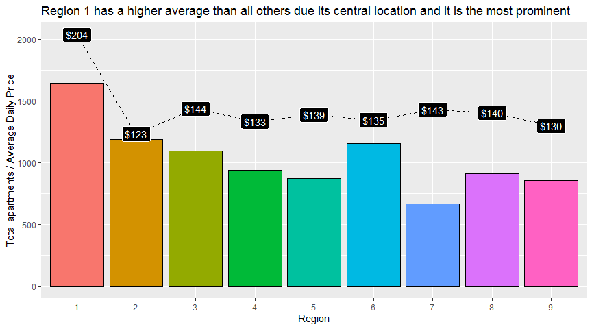
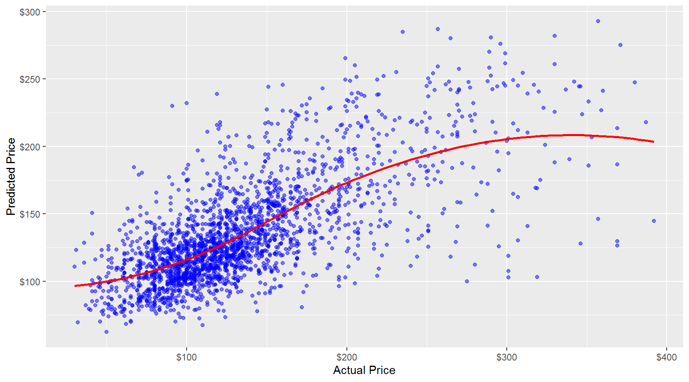
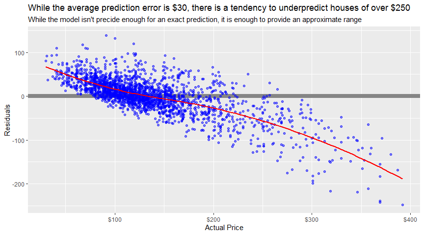
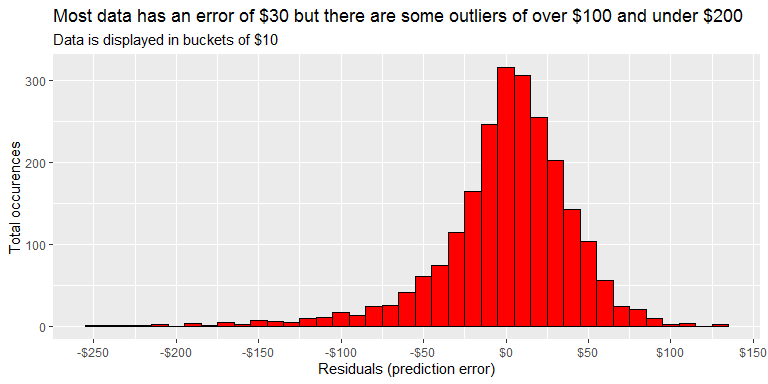

AirBnb Price Prediction Model
================

# Introduction

## Why this dataset

I’ve always been fascinated with the italian culture (and food\!). So
much so, that this year I’ve started learning Italian. While looking to
work on a data science project, I found this dataset on kaggle and
thought it would be interesting to dive into it. This might also count
as very good research before I visit the city as well, at some point in
the future, in order to ensure I don’t pay any more than I have to, and
thus, be able to spend more money on italian pasta and local
experiences.

## Problem statement

**We would like to predict the price at which an apartment should be
rented, given a set of variables.**

## Who would benefit from this analysis?

1.  **Help landlords calculate the optimal price for their apartment**
2.  **Help tourists understand if they’re getting a good deal**
3.  **Potentially useful EDA & Regression data for beginner/intermediate
    data scientists looking to explore what’s possible** (although in no
    way do I consider myself an expert)
4.  **Provide a model that others might want to use if they were
    interested in other cities, as AirBnb data is fairly standardised**

# 2\. Key Insights:

## Summary:

  - Region did not prove to be a significant predictor of the price.
    Rather, proximity to the city centre was seen as more important in
    being able to predict the price

  - We used three different models in our project: Stepwise Regression,
    Gradient Boosting Machine and Random Forrest. The Random Forrest
    model was proven to be the best model in terms of Rsquared (0.46),
    MAE ($30) and RMSE ($42)

  - why it didn’t do well in the higher prices

  - Important factors

# 3\. Full project

Full analysis available:

  - at the following
    [link](http://htmlpreview.github.io/?https://github.com/peterhontaru/AirBnb-Milano-Price-Prediction/blob/master/AirBnb-Milan.html)
  - md document
  - in the **Exploratory-Data-Analysis.md** of this repo (however, I
    recommend previewing it at the link above since it is rendered as
    html)
