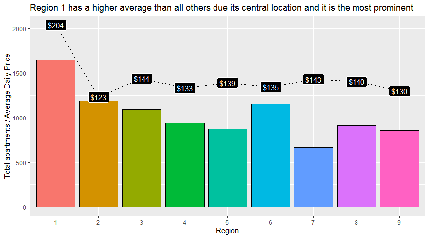
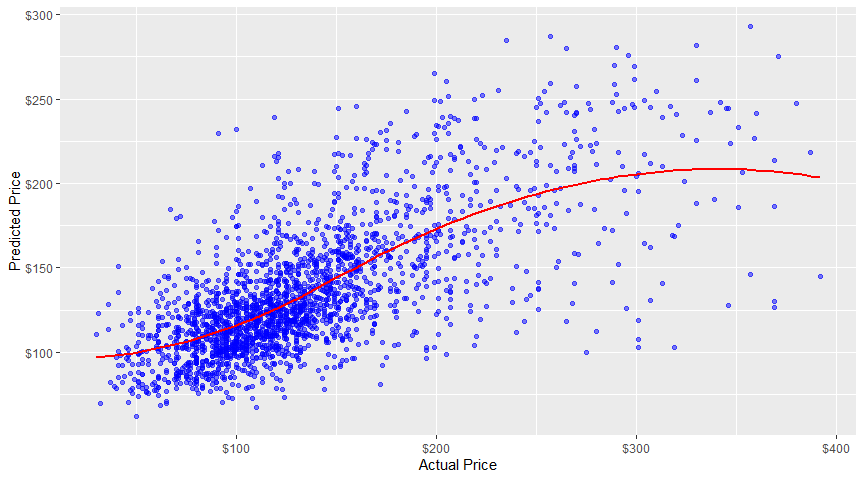
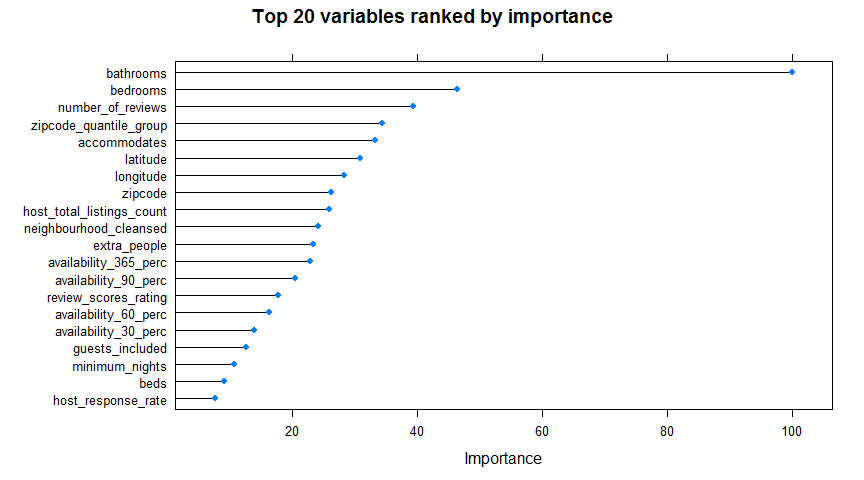

AirBnb - Milan - Price Prediction Model
================

# Introduction

## Problem statement

**Can we predict the price at which an apartment should be rented based
on a number of variables? If so, which variables influenced the price
the most?**

## Who is this project intended for?

  - **landlords** looking to calculate the optimal price for their
    apartment
  - **tourists** trying understand if they’re getting a good deal
  - *those looking to find a model that might fit other datasets, since
    the AirBnb data is generally standardised across countries/cities*

## Why this dataset?

I’ve always been fascinated with the italian culture, history, places
(and food\!), so much so that this year I’ve started learning Italian.
While looking to work on a data science project, I found this dataset on
kaggle and thought it would be interesting to dive into it.

# Key Insights:

## Summary:

  - the region did not prove to be a significant predictor of the price.
    Rather, the proximity to the city centre was shown to be more
    important

  - we used three different models in our project: Stepwise Regression,
    Gradient Boosting Machine and Random Forrest. The Random Forrest
    model was proven to be the most optimal model in terms of Rsquared
    (0.46), MAE ($30) and RMSE ($42)

  - while this model has a similar or higher Rsquared values to that of
    other AirBnb analyses (ie. Milan, New York), it is not high enough
    to provide an accurate predicton, shown by an average error of
    around $30

  - the most important variables were shown to be the number of
    bedrooms, bathrooms, reviews, people to accommodate and the zipcode

**NB**: A logarithmic approach to the price prediction model was also
used outside of this analyis. However, I decided against including that
in this wrap-up due to the following:

  - it did not produce significantly better results
  - it would make the wrap-up a longer longer (almost 2x the length of
    the current version)
  - its stats are not as straightforward to understand

## Next steps / Recommendations:

  - there are a number of variables which are not included in this
    dataset such as apartment size, picture analysis, text of the
    reviews and the description of the property which would have
    improved the accuracy of the model
  - it might also prove helpful to develop a dashboard where the user
    can input apartment values and receive a prediction range that they
    should consider using

## Where did the data come from?

Dataset available from kaggle (link below), made available by Antonio
Mastrandrea and representative of the AirBnb data in July 2019.
<https://www.kaggle.com/antoniokaggle/milan-airbnb-open-data-only-entire-apartments>

# Extended analysis

Full project available:

  - at the following
    [link](http://htmlpreview.github.io/?https://github.com/peterhontaru/AirBnb-Milano-Price-Prediction/blob/master/AirBnb-Milan.html),
    in HTML format
  - in the **AirBnb-Milan.md** file of this repo (however, I recommend
    previewing it at the link above since it originally designed as a
    html document)
