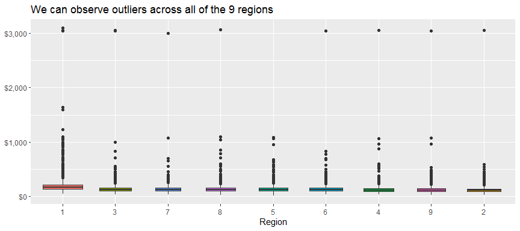
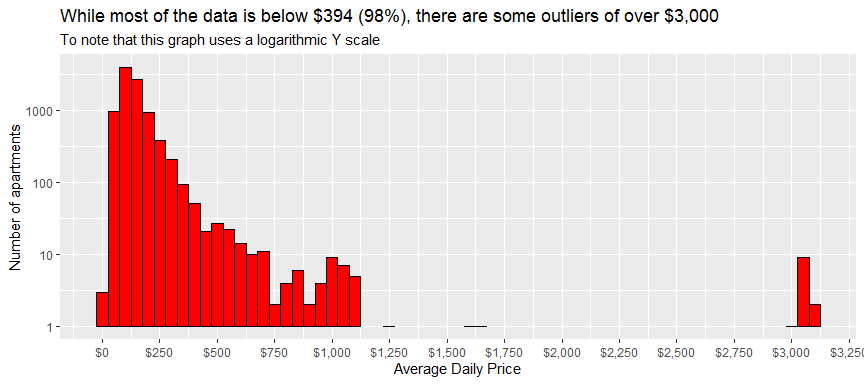

AirBnb Price Prediction Model
================

# Introduction

## Why this dataset

I’ve always been fascinated with the italian culture (and food\!). So
much so, that this year I’ve started learning Italian. While looking to
work on a data science project, I found this dataset on kaggle and
thought it would be interesting to dive into it. This might also count
as very good research before I visit the city as well, at some point in
the future, in order to ensure I don’t pay any more than I have to, and
thus, be able to spend more money on italian pasta and local
experiences.

## Problem statement

**We would like to predict the price at which an apartment should be
rented, given a set of variables.**

## Who would benefit from this analysis?

1.  **Help landlords calculate the optimal price for their apartment**
2.  **Help tourists understand if they’re getting a good deal**
3.  **Potentially useful EDA & Regression data for beginner/intermediate
    data scientists looking to explore what’s possible** (although in no
    way do I consider myself an expert)
4.  **Provide a model that others might want to use if they were
    interested in other cities, as AirBnb data is fairly standardised**

### Dataset information:

  - Contains \>120,000 videos across three countries (Canada, Great
    Britain, United States of America)
  - 8 months of Daily Trending data between “2017-11-14” and
    “2018-06-14” (approx 200 videos/day/country)
  - All the data is downloaded from
    <https://www.kaggle.com/datasnaek/youtube-new> - *Raw data files are
    available within the “Datasets” folder*

# 2\. Key Insights:

### Correlation plot:

# 3\. Full project

Full analysis available:

  - at the following
    [link](http://htmlpreview.github.io/?https://github.com/peterhontaru/AirBnb-Milano-Price-Prediction/blob/master/AirBnb-Milan.html)
  - in the **Exploratory-Data-Analysis.md** of this repo (however, I
    recommend previewing it at the link above since it is rendered as
    html)
