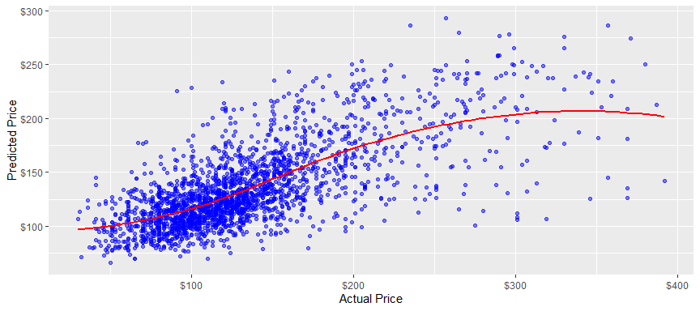
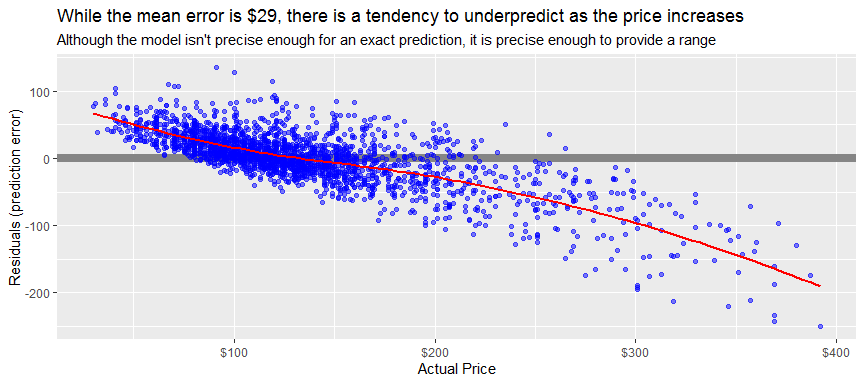
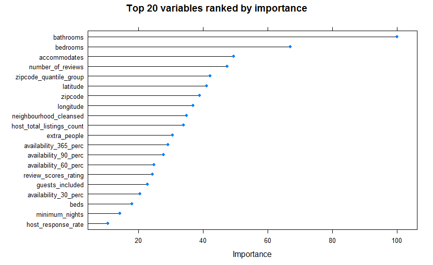

---
    output:
      github_document:

      fig_width: 9
      fig_height: 4
      fig_align: "center"
    
      code_folding: hide
      
    title: "Price Prediction - AirBnb Apartments in Milan"
    subtitle: "Exploratory Data Analysis and Price Prediction Model"
    author: "by Peter Hontaru"
---

# Introduction

## Problem statement

**Can we predict the price at which an apartment should be rented based on a number of variables? If so, which variables influenced the price the most?**

## Who is this project intended for?

* **landlords** looking to calculate the optimal price for their apartment
* **tourists** trying understand if they're getting a good deal
* *those looking to find a model that might fit other datasets, since the AirBnb data is generally standardised across countries/cities*

## Why this dataset?

I've always been fascinated by the italian culture, history, places and food, so much so that this year I've started learning Italian. While looking to work on a data science project, I found this dataset on kaggle and thought it would be interesting to dive into it.

# Key insights

## Summary:

* we used three different models in our project: 

  - **Stepwise Regression** (Rsquared 0.432)
  - **Gradient Boosting Machine** (Rsquared 0.446)
  - **Random Forrest** (Rsquared 0.486)

* the **Random Forrest** model was proven to be the most optimal model:

  - **Rsquared** (0.486)
  - **MAE** (\$29) 
  - **RMSE** (\$42)

* while this model has a similar or higher Rsquared to that of other AirBnb analyses (ie. Milan, New York), it is not high enough to provide an accurate predicton, shown by an average error of ~$29

* the most important variables were shown to be the number of **bedrooms**, **bathrooms**, **reviews**, and **number of people to accommodate**

* the **region** did not prove to be a significant predictor of the price. Rather, the proximity to the city centre was shown to be more important, as shown by the **latitude**, **longitude** or **zipcode group**

* the usual **services** we look for when booking accommodation (Wi-Fi, heating, kitchen, etc) were not shown to be important in predicting prices, given that most apartments have them and thus, they weren't enough to justify a higher price

**NB**: A logarithmic approach to the price prediction model was also used outside of this analyis. However, I decided against including that in this wrap-up due to the following:

* it did not produce significantly better results
* it would make the wrap-up a lot longer (almost 2x the length of the current version)
* its stats are not as straightforward to understand

## Next steps / recommendations:

* there are a number of variables which are not included in this dataset such as apartment size, picture analysis, text of the reviews and the description of the property which would have improved the accuracy of the model. Assessing these would likely improve the performance of the prediction model
* it might also prove helpful to develop a dashboard where the user can input variables and receive a prediction range that they might want to consider

## Where did the data come from?

The dataset was downloaded from kaggle (link below). It was made available by Antonio Mastrandrea and it is representative of the AirBnb data in July 2019.

https://www.kaggle.com/antoniokaggle/milan-airbnb-open-data-only-entire-apartments

# Extended analysis

Full project available

* at the following [link](http://htmlpreview.github.io/?https://github.com/peterhontaru/Price-Prediction-AirBnb-Milan-Apartments/blob/master/AirBnb-Milan.html), in HTML format
* in the **AirBnb-Milan.md** file of this repo (however, I recommend previewing it at the link above since it originally designed as a html document)